# LAPP-Security-Guide
A guide to securing a LAPP stack in regards to encrypting the PostgreSQL database, installing certificates, protecting against any web attacks, and other hardening techniques

## Setup of the stack
### Install Ubuntu 18.04	
* For the purposes of the manual, we will be using virtual box to install Ubuntu 18.04 into a virtual machine.
  * https://www.ubuntu.com/download/desktop
  * Download Ubuntu 18.04 desktop from here
* If you are installing this on a stand-alone system, create a bootable USB of Ubuntu 18.04
  * Rufus is recommended as the tool of use. Rufus can be downloaded from here:
    * https://rufus.ie/
  * Install Ubuntu on the system in your own way. You can skip the Virtualbox steps
### Virtual box steps:
1. Click "New" on Virtual Box:

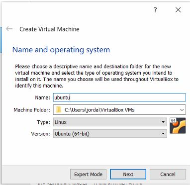

2. Select your memory (recommended 4GB at least)
3. Create new virtual hard disk (VDI)
   - At least 15GB
4. Now that your VM is allocated, click Settings and click Storage:
   - Highlight the IDE disk controller, and click the CD on the right
   - Navigate to the Ubuntu 18.04 ISO image

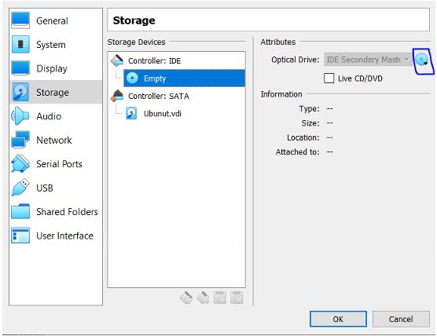

   
5. Boot your VM, and install Ubuntu

## Installing Apache, PostgreSQL, and PHP

### Install and update the system:
- Update the OS:

	```~$ sudo apt update```
		
- Install Apache:

	```~$ sudo apt install apache2 apache2-utils```
		
- Install PHP:

	```~$ sudo apt install php php-pgsql libapache2-mod-php```
	
- Install PostgreSQL:

	```~$ sudo apt install postgresql postgresql-contrib```

### Install files to correct place:
* Place the php and html files in the directory /var/www/html
* You will get errors if you try and test the page after this step because the database has not been created yet. However, the directory should look like this:

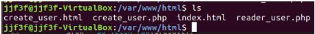

### Configure PostgreSQL:
* Switch to the root user and set the password for the postgres user:
	
	```~$ sudo -i -u root```
	
	```~$ passwd postgres```
	

* Switch to the postgres user and perform the following commands to create a new password for the default postgres user's database:
```
~$ psql
psql (10.6 (Ubuntu 10.6-0ubuntu0.18.04.1))
Type "help" for help.
```
	
```postgres=# \password postgres
Enter new password:
Enter it again:
postgres=# \q
```
* Switch back to the user created originally or root, and edit the following config file:
	
	```~$ sudo subl /etc/postgresql/10/main/pg_hba.conf```
	
* Edit the instances that say "peer", and change them to "md5"
  - Your file should look like this:

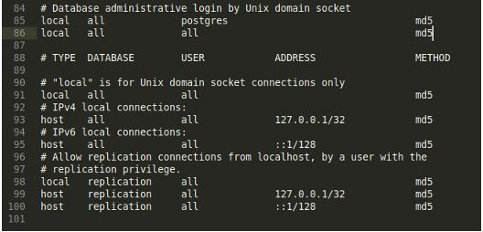

**Take note of line 86 that has been added. This is to ensure the authentication of any other database users**

It is possible to install phppgadmin at this point to get a visual configuration of your database, but for the rest of this guide, we will be using the command line (psql)

Now that the system is configured, we can create the database

## PostgreSQL Database Creation and Role Configuration

### Create the database and userpass table:

* Create database: 
```
postgres=# CREATE DATABASE "userdb";
CREATE DATABASE
postgres=# GRANT ALL ON DATABASE "userdb" TO postgres;
GRANT
```
* Switch to the database:
```
postgres=# \connect userdb
You are now connected to database "userdb" as user "postgres".
userdb=# 
```
* Create Table:
```	
userdb=# CREATE TABLE userpass (
userdb(# uname VARCHAR (50) UNIQUE NOT NULL PRIMARY KEY,
userdb(# pass VARCHAR (60) NOT NULL
userdb(# );
CREATE TABLE
```
* Add the following constraints to ensure the attributes are configured correctly:
```	
userdb=# ALTER TABLE userpass ADD CONSTRAINT unameLengthCheck CHECK (char_length(uname) >= 3);
ALTER TABLE
userdb=# ALTER TABLE userpass ADD CONSTRAINT pwLengthCheck CHECK (char_length(pass) >= 8);
ALTER TABLE
userdb=# ALTER TABLE userpass ADD CONSTRAINT makeunique UNIQUE (uname);
ALTER TABLE
userdb=# 
```

* Create the users of the database:
  - We want to create two separate users:
    - PhpReader
    - PhpInserter
  - Grant both users the ability to connect to the database, and to use the database:

**BE SURE THAT THE USER NAME DOES NOT HAVE UPPERCASE CHARACTERS**
```	
postgres=# CREATE USER phpreader WITH PASSWORD 'readerPW';
CREATE ROLE
postgres=# CREATE USER phpinserter WITH PASSWORD 'inserterPW';
CREATE ROLE
postgres=# GRANT CONNECT ON DATABASE userdb TO phpreader;
GRANT
postgres=# GRANT CONNECT ON DATABASE userdb TO phpinserter;
GRANT
userdb=# GRANT USAGE ON SCHEMA public TO phpinserter;
GRANT
userdb=# GRANT USAGE ON SCHEMA public TO phpreader;
GRANT
```
* Grant phpReader only the ability to select on the userpass table, and phpInserter only the ability to insert on the userpass table:
```
userdb=# GRANT SELECT ON userpass TO phpreader;
GRANT
userdb=# GRANT INSERT ON userpass TO phpinserter;
GRANT
```
		
		
* Enable pgcrypto:
  - We need to enable pgcrypto so that the crypt function will work in php:
```
postgres=# CREATE EXTENSION pgcrypto;
```

* PHP config switches:
  - Make sure that in the php, the database, user, and password is entered correctly on the connect line:
    - In the create_user.php code:
```$dbconn = pg_connect("dbname=userdb user=phpinserter password=inserterPW");```
    - In the reader_user.php code:
```$dbconn = pg_connect("dbname=userdb user=phpreader password=readerPW");```
		
		
* Restart Postgresql:
		
	```~$ sudo systemctl restart postgresql```

## Testing a User and Password
* Go to 127.0.0.1 in Firefox:

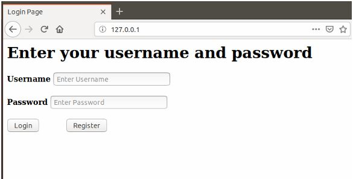

* Let's try to Register a new user:
  - Type in the username, and password
  - You should get the following message:
  
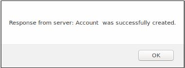

* We can check to see if the user is in the table by returning to the login page
* Type in your username and password. If entered correctly, the following message should display:

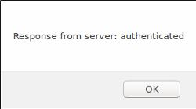

* Let's view the entry in the database
  - Navigate to the database and enter the following query:
  
	```userdb=# Select * from userpass;```

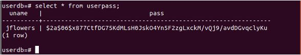


## Security of Usernames and Passwords:

### How are the passwords hashed?

- The passwords are hashed using the crypt function. Let's take a look at the php code that is used to insert a new user to the table:
 
 ```insert into userpass values ('".$userSpecified."', crypt('".$passwordSpecified."', gen_salt('bf')))```

- Crypt(Cleartext password, gen_salt('bf'))
  - This hashes the password with a salt generated by the blowfish algorithm
  - Blowfish allows a max password length of 72 characters which is plenty of characters as of today.
  - It allows for 128 salt bits, and it is adaptive.

  - The user of this system may ask themselves, how in the world does the php reader_user know the salt?
    - The beauty of the crypt function is that it has the following property to it:
      - crypt(correctPW, gen_salt('bf')) == crypt(correctPW, PWinDatabase)
    - So, let's look at the code we use in the php reader user:
      - This line gets the password that corresponds to the user entered:

```$result = pg_query($dbconn, "select pass from userpass where uname='$userSpecified'");```
			
   - The following lines:
     1. Get the number of rows that were queried by result
     2. If there is only one row returned (There should only be 1 unless an attack was performed) we continue
     3. Get the password in the database
     4. If the password in the database is equivalent to crypt(clear text password entered, password in database)
        - Authenticated
     5. Else
        - Denied
	
```
$count = pg_num_rows($result);

	if ($count == 1)
	{
		$row = pg_fetch_row($result);
		$test = crypt($passwordSpecified, $row[0]);

		if($test == $row[0])
		{
			echo "authenticated\n";
		}
		else
		{
			echo "denied\n";
		}
	}
```

## PHP Hardening

### Intro
* For this section, we will be using the less secure php files found in the /notsecurephp/ directory

### Registration PHP Code:
* Immediately you may notice that we do not use encryption on our passwords just to show passwords can be stored in cleartext:

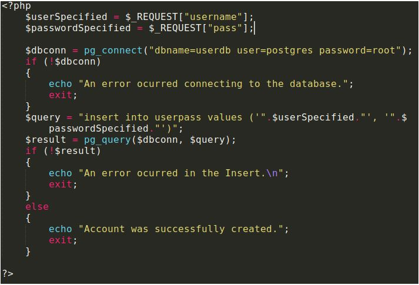

#### Differences between the non-secure register a new user php code above, and the secure php code that we have used previously:

1. We use the root user, postgres, to do all of our database accesses, which allows us to perform deletes, drops, selects, and basically anything that we want to. The way we fix this in the more secure code is by implementing the phpInserter role that can only insert to the database:
     - More secure php code:

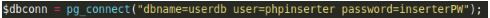

2. The hashing with a salt solution applied to the password. Here we just are storing the password as cleartext, where in our more secure PHP code, the password is hashed and salted using the blowfish algorithm:
      - More secure php code:
      
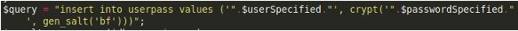

3. We also implement the stripslashes call integrated into php that may prevent against any variety of attacks:
      - More secure php code (added):
 
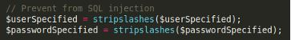

### Login PHP Code:

The following is the login page php file:

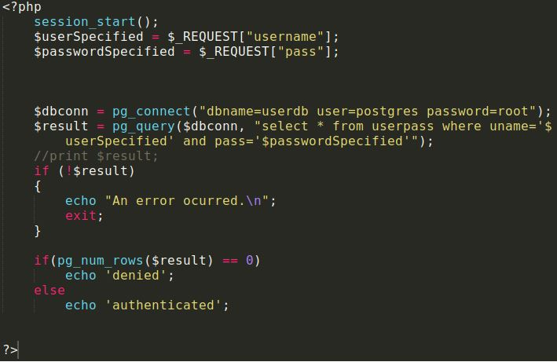

- As you can see, this is an extremely bad php authentication file. The SQL query just finds and instances where the username and password are in the database together. Then, if more than 0 tuples are returned, the user is authenticated. We will see later in the mod security section how this code can be attacked.

#### Differences between the non-secure register a new user php code above, and the secure php code that we have used previously:
1. See #1 above in the register a new user differences
2. See #3 above in the register a new user differences
3. Instead of select *, we should select just the password, and test that against a hashed password using the crypt function
   - More secure PHP code:
 
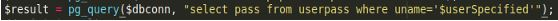
				
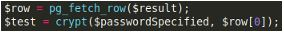

Then, if $row[0] is equivalent to $test, the user has entered the correct password.
This property has an explanation in the section, "Security of Username and Password"

4. Instead of using the logic of more than 0 entries returned, we should test to make sure there is only ONE entry returned:
   - More secure PHP code:

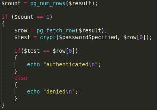

## Mod Security

### Intro:
* In order to test Mod Security, we will be using the notsecurephp files instead for demonstration purposes.
* You will also need the postgresql database set up at this point for the test to work.
* Create a few users on the 127.0.0.1/create_user.html page, and then we can get started
  - Here is a view of the users I have entered:

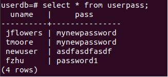

### SQL injection attack:
* So, in this attack, the attacker would like to login as user jflowers. Thus, the attacker would like to return one row, jflowers, without knowing the password.
  - For the username, the attacker will enter just "jflowers"
  - For the password, the attacker will enter the following (without quotes): "notjordanspassword' or 1=1;--"
  - For purposes of demonstration, I changed the type of the textbox to "text" (highlighted in green) so that we can see what the attacker entered:

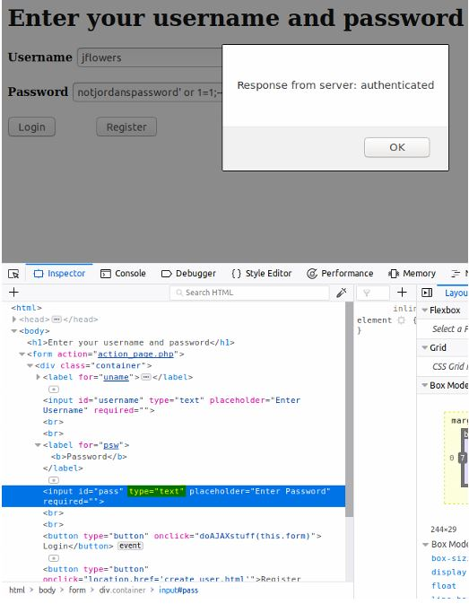

**The SQL injection attack was successful in authenticating the user jflowers without their password.**
	
* Now, let's be really malicious:
  - Type in "notjordanspassword' or 1=1; drop table userpass;--"

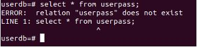

### Installing and configuring mod security (reference hostadvice.com):

* Mod Security allows for the prevention of a plethora of web attacks including XSS, XSRF, SQLi, and many more. For the purposes of this example, we will be preventing all, and demoing the SQLi prevention.
	 
* Run the following to download and install mod security

	```~$ sudo apt-get install libapache2-mod-security2```

* Restart apache:

	```~$ sudo service apache2 restart```

* Ensure the module was loaded by running

	```~$ sudo apachectl -M | grep --color security```
		
* You should see "security2_module (shared)"
* In order to load the config file that comes with mod security, run the following command:

	```~$ sudo mv /etc/modsecurity/modsecurity.conf-recommended /etc/modsecurity/modsecurity.conf```
		
* Edit the modsecurity.conf file by entering:

	```~$ sudo vim /etc/modsecurity/modsecurity.conf```

  - Make the following changes:
    - Set "SecRuleEngine" to "On" instead of "Off"
      - By default mod security only detects which logs in the log file located at /var/log/apache2/modsec_audit.log
    - Set "SecResponseBodyAccess" to "Off" instead of "On"

* Restart apache:

	```~$ sudo service apache2 restart```
		
	
### Setting Rules:
* In order for mod security to know how to use the Core Rule Set, we need to tell mod security where to look:
  - Rename the default rules directory to make a backup:

	```~$ sudo mv /usr/share/modsecurity-crs /usr/share/modsecurity-crs.bk```

   - Download the updated ruleset from github (if you don’t have git installed, run ~$ sudo apt install git

	```~$ sudo git clone https://github.com/SpiderLabs/owasp-modsecurity-crs.git /usr/share/modsecurity-crs```
	
* Copy the sample config out of example into the actual config file:
	
	```~$ sudo cp /usr/share/modsecurity-crs/crs-setup.conf.example /usr/share/modsecurity-crs/csr-setup.conf```

* Edit the security2.conf file to enable these rules:
	
	```~$ sudo nano /etc/apache2/mods-enabled/security2.conf```

* Add these lines within the <IfModule> </IfModule>:
```
	IncludeOptional /usr/share/modsecurity-crs/*.conf
	IncludeOptional /usr/share/modsecurity-crs/rules/*.conf
```
* Save the file and restart apache:
	
	```~$ sudo service apache2 restart```
			

### Testing Mod Security:
* Perform the same attack above:
  - For the username, the attacker will enter just "jflowers"
  - For the password, the attacker will enter the following (without quotes): "notjordanspassword' or 1=1;--"
  - As you can see, the server returns a 403 forbidden:
  
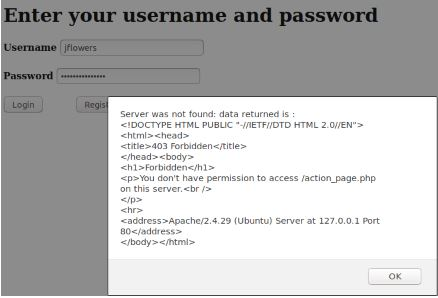
		
  - Thus, mod security is installed and working. If the user wants to check logs for mod security, these can be located in the following location:
    - /var/log/apache2/modsec_audit.log
  - Here is what rule we triggered with the sql injection:

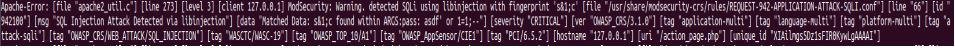
	
## Installing Certificates

### Intro
* There is a huge problem that may be staring the security professionals in the face, and that is the following issue:
  - This part is optional, but if you run wireshark and run the server, you will see the HTTP in clear text.
    - Even though we are sending the password and username data as a POST, these are cleartext if sniffed:


* What is the solution to this problem? Certificates
  - Before doing anything, we should decide on a domain name. We will go with mywebsite.com

### Become a Certificate Authority:
* Create the following directories (blue) and files (white):


  - Where they are all within demoCA and the index.txt file is empty and the serial file only holds a four digit number (1234 or something like that)

* Next, copy the openssl config file into your demoCA directory:
		
	```~/Documents/demoCA$ cp /usr/lib/ssl/openssl.cnf ./```

* Edit the openssl.cnf file, and make the following change to policy:


* Run the following line:

	```$ openssl req -new -x509 -keyout ca.key -out ca.crt -config openssl.cnf```
		
  - The "req" command creates a self-signed certificate to be used as a root certificate authority in our case.
  - "new" means that we will be generating a new certificate request.
  - "-x509" indicates that we need a self-signed certificate instead of an actual request. This is because we are a self-signed root certificate authority.
  - "-keyout" indicates the private key that we have created will be written to ca.key.
  - "-out" indicates this is where standard out is redirected to .
  - "-config" indicates we want to use our own configuration file, openssl.cnf.
  - Source: https://wiki.openssl.org/index.php/Manual:Req(1)


* Now, we are a Certificate Authority and we can create a certificate for our website

Create a Certificate for mywebsite.com
	- First, create a public/private key pair for mywebsite.com:
		$ openssl genrsa -aes128 -out server.key 1024 
		
			- The "genrsa" command generates an RSA private key. 
			- "-aes128" is the cipher that we will be using before outputting the private key. 
			- "-out" is the output redirect to the server.key file. 
			- The size of the private key is 1024 bits.
				□ Source: https://wiki.openssl.org/index.php/Manual:Genrsa(1)
		
		- 
	
	- Next, Generate a Certificate Signing Request:
		- Now that we have a key file, we must generate the CSR. This will include our public key, and it will be sent to the certificate authority.

		- The certificate authority creates a certificate for the key after making sure the information received in the request is the actual server (verify the identity that third parties have to do)
	
		- Run the following:
		$ openssl req -new -key server.key -out server.csr -config openssl.cnf
			
			- The main thing that has changed between this command and the previous command from section 3.1 is that we are no longer wanting a self-signed certificate (due to the lack of -x509). We are actually requesting by specifying the "-key" option. 
			- "-key" indicates where our private key is located for the request.
			- Source: https://wiki.openssl.org/index.php/Manual:Req(1)
		
		- 
		**NOTE THE COMMON NAME. THIS IS A MUST FOR CERTIFICATES. ENTER YOUR DOMAIN NAME THERE.**
		
	- Generate the Certificates:
		- As the certificate authority, we have to sign the CSR file to form the certificate. In order to do this, run the command to turn the request (server.csr generated above) into a x509 certificate (server.crt) using the files from earlier, ca.crt and ca.key:

		- First, run the following to have the directories in order:
			- ~/Documents/demoCA$ mv ca.crt ca.key server.csr server.key openssl.cnf ../ && cd ../

		- Then, generate the certificate:
		
			$ openssl ca -in server.csr -out server.crt -cert ca.crt -keyfile ca.key -config openssl.cnf
			
				- "ca" is used to sign certificate requests. It will generate the crl, and it will maintain the database (index.txt) of issued certificates.
				- "-in" indicates the request we will sign.
				- "-out" is where the certificate will be sent.
				- "-cert" points to the certificate authority's certificate file.
				- "-keyfile" is where the private key is located
				- "-config" specifies our config file we want to be ran
				- Source: https://www.openssl.org/docs/man1.0.2/apps/ca.html


		- Here is the output you should get:
			- 
			
	- Editing the hosts file:
		- Edit /etc/hosts:
			~$ sudo vim /etc/hosts
			
		- Put the top line of my file into your file just like this so that when we type mywebsite.com, we will resolve to 127.0.0.1 instead of performing a DNS request.
		
			- 


		- The page should look like this with the error because it is http only right now:
		
			
			
Enable SSL for Apache and Install Certificates:
	- Enable SSL for Apache:
		- Navigate to /etc/apache2/sites-available/ and copy the configuration file for the port 80 configuration file into a new configuration file that will be used for our https site:
			/etc/apache2/sites-available$ sudo cp 000-default.conf 000-default443.conf

		- Let's edit the file to enable SSL:
			/etc/apache2/sites-available$ sudo vim 000-default443.conf
	
			- Change <VirtualHost *:80> to <VirtualHost *:443> to indicate the port number used for this site
			
			- Add the following lines below the DocumentRoot line:
					SSLEngine on
					SSLCertificateFile /home/jjf3f/Documents/server.crt
					SSLCertificateKeyFile /home/jjf3f/Documents/server.key
					SSLCertificateChainFile /home/jjf3f/Documents/ca.crt
		
			- Your file should look like this:
				
				

			- Navigate to /etc/apache2/sites-enabled/ and create a symbolic link between the file we just created, and a file in the sites-enabled directory:
				/etc/apache2/sites-enabled$ sudo ln -s ../sites-available/000-default443.conf 000-default443.conf
				
			- Enable SSL on the system by running the following:
				/etc/apache2/sites-enabled$ sudo a2enmod ssl
				
			- Restart apache:
				/etc/apache2/sites-enabled$ sudo systemctl restart apache2
				
				**Here you should have to type in the password for the certificate**
			

		- Now, the website should be up, and it should display the following when going to https://mywebsite.com:
			- 
	
			- The certificate is untrusted because Firefox does not have the certificate authority's certificate installed onto the browser, so let's add it:
				1. Go to Preferences:
					a) 
	
				2. Navigate to view certificates:
					a) 
			
				3. Import under authorities:
					a) 
			
				4. Select ca.crt and hit OK:
					a) 
			
				5. You should see the following entry:
					a. 
		
		
		Result:
			- After a restart of Firefox, we see that the certificate is trusted:
				□ 
		
			- Can Wireshark see those passwords now?
				
				No, it is all encrypted.
		
